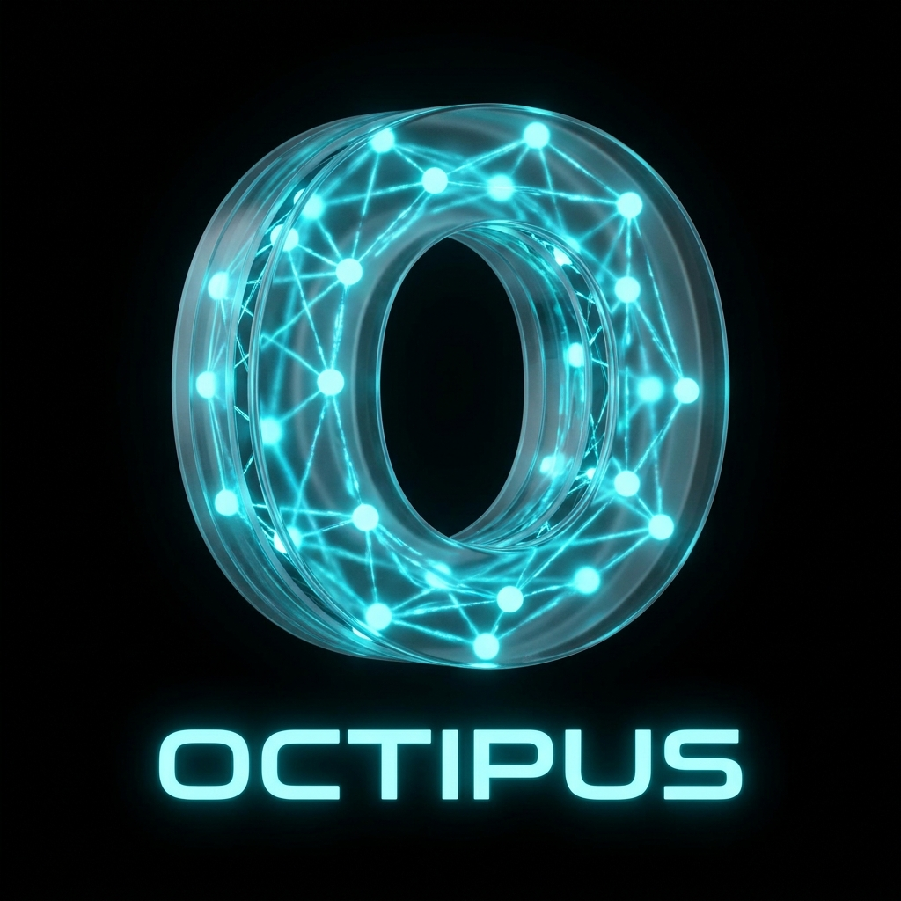

<p align="center">
  
</p>

# The Assistant

> **v0.1 · alpha · building in public.** A working, opinionated platform — not a finished product. Breaking changes happen; migration notes ship with them. Treat it as a foundation to build on.

**Website:** [https://the-assistant.app](https://the-assistant.app)

---

## What it is

An open-source, self-hosted assistant that delegates real work to a swarm of specialist AI agents. Send a message — research, code, audit, write, schedule — and the orchestrator picks the right experts, fans them out in parallel, and ships a result back over the channel you used (Telegram, Slack, web, voice, MCP, …).

You bring the models. Your data stays on your infrastructure. Every model provider, every channel, every skill is yours to configure.

## Project goal

An assistant that automates digital work — the boring, the repetitive, the cross-tool — and assists you with the rest. Not a chatbot wrapper. A platform that *executes*: it reads your repo, edits your files, runs your tests, fills your forms, schedules your meetings, and tells you what it changed.

## Community

Contributions of every size welcome — bug reports, doc fixes, new roles, new channels, new tools.

- **GitHub Issues** — bugs and concrete feature requests
- **GitHub Discussions** — proposals, design conversations, show-and-tell
- **[CONTRIBUTING.md](./CONTRIBUTING.md)** — setup, repo layout, PR checklist
- **[DESIGN.md](./DESIGN.md)** — the principles every PR runs through
- **[CODE_OF_CONDUCT.md](./CODE_OF_CONDUCT.md)** — how we run arguments
- **[ROADMAP.md](./ROADMAP.md)** — what's in flight

For security issues, see [SECURITY.md](./SECURITY.md). **Do not** file security reports as public issues.

## Architecture in one paragraph

```
Channels → Gateway (WebSocket, typed Zod protocol)
          → Orchestrator (classify → route → spawn)
            → Agents (3-level Swarm: Orchestrator → Agent → Subagent)
              → Tools / Skills / Experts / Pipelines
                → Models (Ollama, OpenAI, Anthropic, Gemini, OpenRouter, LiteLLM, CLI)
                  → Postgres + pgvector + Redis (or PGlite + in-memory for embedded)
```

**Hierarchy:** Tools (executable capabilities) → Skills (domain knowledge) → Experts (pre-configured personas) → Agents (runtime workers, 3-level Swarm via `spawn_child`) → Pipelines (sequential handover with approval gates).

Deep dive: [docs/AGENT-ARCHITECTURE.md](docs/AGENT-ARCHITECTURE.md) · [.assistant/swarm-design.md](.assistant/swarm-design.md).

## Key points covered in v0.1

- **3-level Swarm** with `spawn_child` meta-tool — `await` and `detach` modes, `parallelGroup` fan-out, `collect_children` for explicit gather. Per-node hard budgets (tokens / wall-clock / fan-out), `AbortSignal` cascade cancel, fingerprint cycle protection, escalation on budget breach.
- **Error classification** — single canonical taxonomy (`FailoverReason`, `RecoveryAction`, `ClassifiedError`). All 8 model providers migrated off ad-hoc string matching.
- **Anti-thrashing session compaction** — LLM summarization with stall detection, ≥15% savings gate, hard-ceiling safety valve.
- **Trajectory learning** — JSONL audit log of every agent run, daily rolling, opt-out via env. Foundation for offline eval and fine-tuning.
- **Skill auto-extension (detector)** — pattern fingerprinting → `skill_proposals` queue, never auto-promotes; review UI surfaces high-frequency patterns.
- **MCP circuit breaker** — closed/open/half-open with exponential backoff, admin reset, UI badge.
- **Fail-loud routing** — strict `getModelForTopic()`, no silent fallbacks; unbound topics fail with a clear error.
- **26 E2E test modules** + 855+ unit tests + red-team plugins (prompt injection, role confusion, tool misuse, data leakage, off-topic drift).

## Technologies and ideas worth a look

- **Bun** runtime end to end — fast tests, single lock, single package manager.
- **Drizzle ORM** + Postgres + **pgvector** for hybrid (BM25 + vector) RAG.
- **PGlite** for embedded mode — zero external deps, single-user.
- **WebSocket gateway** with typed Zod protocol — every channel speaks the same dialect.
- **Three-tier permission system** (ALLOW / ASK / DENY) with pre/post hooks and audit trail.
- **Three-layer prompt-injection defense** — system preamble + 39-pattern input guard + LLM output guard.
- **AES-256-GCM encrypted vault** with per-tool access control.
- **Topic → model routing** — config-driven, no hardcoded defaults.
- **Browser extension** for human-in-the-loop control of the user's real Chrome.

## Feature set (current state)

| Area | What's there |
|---|---|
| **Agents** | 3-level Swarm, 16 roles, 15 expert personas, 20 domain skills |
| **Models** | Ollama, OpenAI, Anthropic, Gemini, OpenRouter, DeepSeek, Voyage, LiteLLM, CLI (Claude Code / Gemini CLI / Codex CLI) |
| **Tools** | Filesystem, shell (local/SSH/Docker), git, browser (Playwright + extension), web search, Docker, knowledge base, scheduling, voice, M365, GitHub/GitLab, MCP — 59+ across 19 groups |
| **Channels** | Telegram, Slack, Teams, WhatsApp, web UI, TUI (Ink), voice (Twilio), MCP server |
| **Knowledge** | Hybrid search (BM25 + vector), tiered content, auto-indexing, document ingest + OCR |
| **Automation** | Hooks, webhooks, cron tasks, plugin system |
| **Eval** | Provider conformance suite, 8 quality evaluators, red-team plugins (5 attacks, 49 cases) |
| **Security** | WebAuthn passkeys, TOTP 2FA, JWT sessions, encrypted vault, audit log |

Full feature breakdown: see the [documentation index](#documentation) below.

## Quick start

**Embedded (zero external deps, single-user):**

```bash
git clone https://github.com/PatriceA/the_assistant.git
cd the_assistant && bun install
cd web && bun install && cd ..
bun run setup        # interactive config
bun run dev
```

Open [http://localhost:3005/setup](http://localhost:3005/setup) to finish configuration.

**Docker (production):** see [docs/DOCKER.md](docs/DOCKER.md).
**External Postgres + Redis:** see [docs/CONFIGURATION.md](docs/CONFIGURATION.md).

Requirements: **Bun ≥ 1.1**, **Node ≥ 18**, **Docker** (for the full stack), **Postgres 15** (external mode).

## Outlook

Highlights from the [roadmap](./ROADMAP.md):

- **Auto-discovery for tools and channels** — folder convention like roles already have.
- **Skill auto-extension promotion path** — review UI for proposals, one-click promote.
- **Trajectory learning consumers** — labeled training pairs from recorded runs.
- **Dynamic role definition from chat** — "define a role that does X with tools Y" → live role.
- **Skill marketplace** — export/import signed JSON, install from the web UI.
- **Pipeline templates from natural language** — describe a workflow, get a runnable pipeline.
- **First-class human-in-the-loop primitive** — wait-for-input nodes with form schemas.
- **Mobile clients** — native iOS/Android via the gateway protocol.

Open directions (later): federation between assistant instances, local-first sync (PGlite + CRDTs), full-duplex voice, sandboxed tool execution (WASI), plugin signing.

## Documentation

| | |
|---|---|
| **[Agent Architecture](docs/AGENT-ARCHITECTURE.md)** | Tools, skills, experts, agents, swarm |
| **[Tool & Expert Routing](docs/TOOL-ROUTING.md)** | What triggers which tool, role, expert |
| **[Channels](docs/CHANNELS.md)** | Telegram, Slack, Teams, WhatsApp, WebChat |
| **[Chat Commands](docs/CHAT-COMMANDS.md)** | Slash commands across all channels |
| **[API Reference](docs/API.md)** | Complete REST API |
| **[Configuration](docs/CONFIGURATION.md)** | Env vars, ports, services |
| **[Browser Extension](docs/BROWSER-EXTENSION.md)** | Chrome extension for real browser control |
| **[RAG / Knowledge Base](docs/RAG.md)** | Hybrid search, tiered content, auto-indexing |
| **[MCP Server](docs/MCP-SERVER.md)** | Expose assistant as MCP tools |
| **[MCP Integration](docs/MCP-INTEGRATION.md)** | Connect external MCP servers |
| **[Hooks & Automation](docs/HOOKS.md)** | Event hooks, webhooks, cron, execution control |
| **[Webhooks](docs/WEBHOOKS.md)** | GitHub/GitLab event ingestion |
| **[Capability Comparison](docs/CAPABILITY-COMPARISON.md)** | Feature comparison vs alternatives |
| **[Development](docs/DEVELOPMENT.md)** | Project structure, commands, tech stack |
| **[Testing](docs/TESTING.md)** | Test matrix (unit, E2E, integration, red-team) |
| **[Troubleshooting](docs/TROUBLESHOOTING.md)** | Common issues and solutions |

## License

[MIT](./LICENSE) — free to use, copy, modify, distribute, sublicense, and sell. No warranty. Use at your own risk.

Copyright © 2026 Patrice Allegue and contributors.
