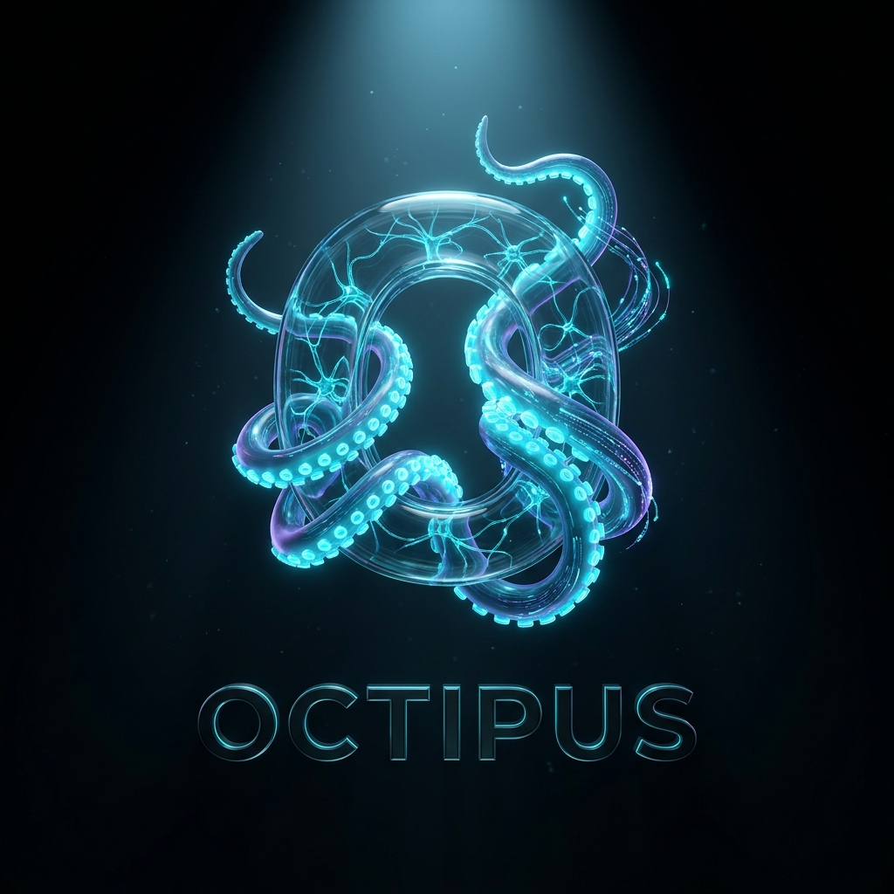

<p align="center">
  
</p>

# Octipus

A self-hosted AI workspace for projects, knowledge, and connected tools.

> **v0.4 · alpha · building in public.** A working, opinionated platform — not a finished product. Breaking changes happen; migration notes ship with them. Treat it as a foundation to build on.

**Website:** [https://octipus.cc](https://octipus.cc)

---

## Install

**Requires Node.js 24.19.0 or newer (including npm), Git, and a model provider.** Embedded mode needs no external database. Check `node --version` first; older Node versions can fail on crypto or module loading.

```bash
# Linux / macOS / WSL (Bash + curl) — quick start: five questions, ends with the web UI open
curl -fsSL https://raw.githubusercontent.com/PatriceA/octipus/main/scripts/install.sh | bash -s -- --quick
```

```powershell
# Windows PowerShell
& ([scriptblock]::Create((irm https://raw.githubusercontent.com/PatriceA/octipus/main/scripts/install.ps1))) -Quick
```

Quick start uses embedded storage with default paths and ports, asks for an admin account and one model provider, then runs `octi start web` and opens **http://localhost:3007**. Drop `--quick` / `-Quick` for the full wizard (storage mode, ports, optional tools, voice); it ends with `octi start web` as the next step. Add the printed CLI directory to PATH if your shell needs it.

For Docker without host Node/npm, clone this repository and run `bash scripts/install-docker.sh`; the web UI is **http://localhost:3017**.

**[Full installation guide](docs/INSTALLATION.md)** — prerequisites, one-command start, manual install, headless setup, audits, upgrades, Docker, and troubleshooting.

---

## What it is

Octipus is an open-source, self-hosted AI workspace for working with projects,
knowledge, and connected tools. You can use it through a web interface, terminal,
or messaging channel, and choose local or hosted model providers.

The root agent answers with its own tools and can delegate bounded tasks to
specialist agents. Pipelines support explicit stages and human input. Available
capabilities depend on your models, installed tools, connections, and permissions.

## Project goal

The goal is to make everyday work easier to carry out and inspect: investigate a
codebase, prepare a sourced report, or turn information into follow-up tasks.
Octipus provides execution records, configurable permissions, and budget controls
to help you understand what ran and what needs attention.

This is an alpha project. Model output and tool execution can fail, and completed
work still needs verification. Local models support a self-hosted setup; hosted
providers and external connectors receive the data sent to them. Self-hosting
lets you choose those connections, but does not make every workflow local.

The current improvement cycle focuses on measuring workflow reliability and
reviewing the execution code. Permission, status-reporting, navigation, and
acceptance-test changes from phases 1–4 are on `main`; the remaining evidence
and limitations are tracked in the
[consolidation report](docs/reports/consolidation-2026-09-10.md).

## Community

Contributions of every size welcome — bug reports, doc fixes, new roles, new channels, new tools.

- **GitHub Issues** — bugs and concrete feature requests
- **GitHub Discussions** — proposals, design conversations, show-and-tell
- **[CONTRIBUTING.md](./CONTRIBUTING.md)** — setup, repo layout, PR checklist
- **[DESIGN.md](./DESIGN.md)** — the principles every PR runs through
- **[CODE_OF_CONDUCT.md](./CODE_OF_CONDUCT.md)** — how we run arguments
- **[ROADMAP.md](./ROADMAP.md)** — what's in flight

For security issues, see [SECURITY.md](./SECURITY.md). **Do not** file security reports as public issues.

CLI execution can reuse vendor logins where permitted. See [CLI agents](docs/CLI-AGENTS.md) for subscription, tool, plan and permission behavior.

## Architecture in one paragraph

```
Channels → Gateway (WebSocket, typed Zod protocol)
          → Root agent (answers with its own tools; spawns when a specialist is needed)
            → Agents (3-level Swarm: root → Agent → Subagent)
              → Tools / Skills / Experts / Pipelines
                → Models (Ollama, OpenAI, Anthropic, Gemini, OpenRouter, LiteLLM, CLI)
                  → Postgres + pgvector (or embedded PGlite)
```

**Hierarchy:** Tools (executable capabilities) → Skills (domain knowledge) → Experts (pre-configured personas) → Agents (runtime workers, 3-level Swarm via `spawn_child`) → Pipelines (sequential handover with approval gates).

Deep dive: [docs/AGENT-ARCHITECTURE.md](docs/AGENT-ARCHITECTURE.md) · [.octipus/swarm-design.md](.octipus/swarm-design.md).

## Key points covered in v0.4

- **Install and setup** — `--quick` route (embedded storage, five prompts, ends with the web UI open), locked `npm ci` installs with every surface built before the first start, a Docker one-command installer, Node 24.19 floor, and a Windows installer with its own CI job. The wizard binds the chosen model to every text topic, verifies provider settings actually saved, and logs in on rerun instead of re-registering.
- **Honest diagnostics** — `octi doctor` reads the checkout's `.env`, asks the running backend for provider status, and no longer reports a wrong API key as "not configured".
- **Streaming and sessions** — root-agent replies stream token by token to the TUI and web; `/sessions`, `/resume`, `--session` and `/history` continue earlier conversations; the status bar carries the work plan, elapsed time and model.
- **Terminal UI** — one shared event presenter for the chat shell and the editor, a decision queue that never drops an unanswered permission or approval prompt, row scrolling that holds your reading position while replies stream, editor drafts that survive a crash, and an unsaved-changes prompt. The e2e suite runs the shipped entry in a real PTY.
- **One agent loop per turn** — the orchestrator hop is gone; the agent you talk to holds real tools, with the swarm limits below unchanged.

## Earlier: key points covered in v0.2

- **3-level Swarm** with `spawn_child` meta-tool — `await` and `detach` modes, `parallelGroup` fan-out, `collect_children` for explicit gather. Per-node token, wall-clock, and fan-out limits; cancellation propagation; fingerprint cycle protection; and escalation on a detected budget breach. Limits constrain Octipus execution but cannot guarantee exact provider billing or immediate cancellation of external work.
- **Error classification** — single canonical taxonomy (`FailoverReason`, `RecoveryAction`, `ClassifiedError`). All model providers migrated off ad-hoc string matching.
- **Anti-thrashing session compaction** — LLM summarization with stall detection, ≥15% savings gate, hard-ceiling safety valve.
- **Trajectory records** — JSONL records of agent runs, daily rolling, with an environment opt-out. These records are inputs for offline evaluation or training workflows; they do not make the running system learn automatically.
- **Skill auto-extension** — pattern fingerprinting → `skill_proposals` queue with curator lifecycle (usage tracking, archive after 90d); review UI surfaces high-frequency patterns; never auto-promotes.
- **MCP circuit breaker** — closed/open/half-open with exponential backoff, admin reset, UI badge.
- **Fail-loud routing** — strict `getModelForTopic()`, no silent fallbacks; unbound topics fail at spawn time with a clear error.
- **Root agent persona** — per-user identity (name, tone, narration, free-form facts) layered between `SECURITY_PREAMBLE` and the role prompt via the `before-agent-start` hook; six presets ship under `personas/`. Default is *Octipus*, the dry octopus-machine.
- **Root agent detach** — parent can detach children and use `collect_children` to await later; enables narration and user interaction while children run in parallel.
- **Enrichment features** — Reader (fetch + extract web content), Deep Research (report generation with source references, document persistence and knowledge indexing when available; durable job tracking; interrupted work is reported after restart), To-Do list (recurring via scheduler), Email triage (batch classification), and hardware-aware onboarding (curated Ollama catalog plus registry data).
- **Testing and evaluation** — unit, database integration, and browser suites, plus model evals and adversarial case generators. The red-team CI job is a dry-run without model calls; see [Testing](docs/TESTING.md) for what each suite verifies.

## Technologies and ideas worth a look

- **Node** end to end — one runtime for the server, the scripts, the tests and the web build.
- **Drizzle ORM** + Postgres + **pgvector** for hybrid (BM25 + vector) RAG.
- **PGlite** for embedded mode — zero external deps, single-user.
- **WebSocket gateway** with typed Zod protocol — every channel speaks the same dialect.
- **Three-tier permission system** (ALLOW / ASK / DENY) with pre/post hooks and audit trail.
- **Prompt-injection mitigations** — a system preamble, input checks, and an LLM output guard supplement execution permissions; they do not guarantee that hostile input will be detected.
- **AES-256-GCM encrypted vault** with per-tool access control.
- **Topic → model routing** — config-driven, no hardcoded defaults.
- **Browser extension** for human-in-the-loop control of the user's real Chrome.

## Feature set (current state)

| Area | What's there |
|---|---|
| **Agents** | 3-level Swarm, 16 roles, 18 seeded expert definitions, 22 seeded skills |
| **Models** | Ollama, OpenAI, Anthropic, Gemini, Grok, DeepSeek, Mistral, Z.AI (GLM), Moonshot (Kimi), OpenRouter, Voyage, custom OpenAI/Gemini-compat, LiteLLM, CLI (Claude Code / Codex / Antigravity / Vibe / GLM / Kimi) |
| **Tools** | Filesystem, shell (local/SSH/Docker), git, browser (Playwright + extension), web search, Docker, knowledge base, scheduling, voice, M365, GitHub/GitLab, and external MCP bridges. The standalone MCP server exposes 88 tools across 26 groups. |
| **Channels** | Telegram, Slack, Teams, WhatsApp, web UI, TUI (chat shell + editor, built on [pi-tui](https://www.npmjs.com/package/@mariozechner/pi-tui)), voice (Twilio), MCP server |
| **Knowledge** | Hybrid search (BM25 + vector), tiered content, auto-indexing, document ingest + OCR, authored knowledge graph (notes, `[[wikilinks]]`, Obsidian vault + Canvas) |
| **Enrichment** | Reader (fetch + extract), Deep Research (report with source references → Documents + knowledge base when available), To-Do list, Email triage, Hardware-aware onboarding |
| **Automation** | Hooks, webhooks, cron tasks, plugin system |
| **Eval** | Provider conformance suite, 16 built-in assertion types, red-team plugins (5 attacks, 49 cases) |
| **Security** | WebAuthn passkeys, TOTP 2FA, JWT sessions, encrypted vault, audit log |

Full feature breakdown: see the [documentation index](#documentation) below.

## Quick start

**Embedded (zero external deps, single-user):**

```bash
git clone https://github.com/PatriceA/octipus.git
cd octipus && npm ci
cd web && npm ci && cd ..
cd mcp-server && npm ci && cd ..   # standalone MCP server (not a root workspace)
npm run build
npm --prefix web run build
npm run setup        # the single wizard (same as `octi setup`)
node bin/octi.mjs start web   # backend + web UI (server / browser); works on Windows too
# …or `node bin/octi.mjs start` for the backend alone, then `npm run tui` / `node bin/octi.mjs desktop`
```

Then open [http://localhost:3007](http://localhost:3007) and log in
with the admin account you registered during `octi setup`. There is
no separate web onboarding flow — setup happens in the terminal.

**Desktop app (optional):** the Tauri desktop client needs the Rust toolchain
plus Tauri's system libraries on top of the deps above. One line installs them
all — it detects your platform (Arch/Manjaro, Debian/Ubuntu, Fedora, openSUSE,
macOS) and warms the Cargo cache:

```bash
scripts/install-desktop-deps.sh    # then: octi desktop
```

Or fold it into the one-shot installer with `--desktop`:

```bash
curl -fsSL https://raw.githubusercontent.com/PatriceA/octipus/main/scripts/install.sh | bash -s -- --desktop
```

**Docker (production):** see [docs/DOCKER.md](docs/DOCKER.md).
**External Postgres:** see [docs/CONFIGURATION.md](docs/CONFIGURATION.md).

Requirements: **Node ≥ 24.19**, **Docker** (for the full stack), **Postgres 16** (external mode).

> **Runtime:** Node, everywhere — the server, the scripts, the tests, the TUI and the web build. `npm run build` produces `dist/index.js` and `npm start` runs that artifact, not the source; the web bundle is static files served by `web/serve.mjs`.

## Outlook

Highlights from the [roadmap](./ROADMAP.md):

- **Execution-code review** — simplify shared dispatch and lifecycle paths without weakening permission boundaries.
- **Measured workflow baselines** — run the opt-in live-provider suite and record its configuration and limits.
- **Trajectory learning consumers** — labeled training pairs from recorded runs.
- **Dynamic role definition from chat** — "define a role that does X with tools Y" → live role.
- **Skill marketplace** — export/import signed JSON, install from the web UI.
- **Pipeline templates from natural language** — describe a workflow, get a runnable pipeline.
- **First-class human-in-the-loop primitive** — wait-for-input nodes with form schemas.
- **Mobile clients** — native iOS/Android via the gateway protocol.

Open directions (later): federation between Octipus instances, local-first sync (PGlite + CRDTs), full-duplex voice, sandboxed tool execution (WASI), plugin signing.

## Documentation

| | |
|---|---|
| **[Agent Architecture](docs/AGENT-ARCHITECTURE.md)** | Tools, skills, experts, agents, swarm |
| **[Swarm Reliability & Verification](docs/SWARM-RELIABILITY.md)** | Receipts, scorer gates, crash-resume ledger |
| **[Tool & Expert Routing](docs/TOOL-ROUTING.md)** | What triggers which tool, role, expert |
| **[Channels](docs/CHANNELS.md)** | Telegram, Slack, Teams, WhatsApp, WebChat, Voice, MCP |
| **[Visible Work Plans](docs/WORK-PLANS.md)** | Follow progress and give feedback in web and terminal conversations |
| **[Chat Commands](docs/CHAT-COMMANDS.md)** | Slash commands and channel availability |
| **[API Reference](docs/API.md)** | REST and WebSocket API reference |
| **[Architecture Catalog](docs/architecture/generated/CATALOG.md)** | Generated from the source and gated in CI: every mounted route, the module import graph, the gateway event matrix |
| **[Enrichment Features](docs/ENRICHMENT.md)** | Reader, Deep Research, Tasks, Email triage, Hardware-aware onboarding |
| **[Configuration](docs/CONFIGURATION.md)** | Env vars, ports, services |
| **[LiteLLM Proxy](docs/LITELLM.md)** | Route models through a LiteLLM proxy; auth, adding models, 401 fixes |
| **[Small / Local Models](docs/SMALL-MODELS.md)** | Run on one small local model: setup, what works/degrades, single-model binding |
| **[Ollama](docs/OLLAMA.md)** | Ollama models: size tiers, tool support, context length (`num_ctx`), lazy tool discovery, iGPU |
| **[Direct Providers](docs/DIRECT-PROVIDERS.md)** | Caching, reasoning, tool schemas, usage and cost provenance |
| **[Custom Providers](docs/CUSTOM-PROVIDERS.md)** | Direct OpenAI/Gemini-compatible endpoints |
| **[Configuration Precedence](docs/CONFIGURATION-PRECEDENCE.md)** | `.env`-bootstrap vs DB-runtime split |
| **[Browser Extension](docs/BROWSER-EXTENSION.md)** | Chrome extension for real browser control |
| **[RAG / Knowledge Base](docs/RAG.md)** | Hybrid search, tiered content, auto-indexing |
| **[Knowledge Graph](docs/KNOWLEDGE-GRAPH.md)** | Notes, `[[wikilinks]]`, authored edges, graph traversal, Obsidian vault + Canvas |
| **[MCP Server](docs/MCP-SERVER.md)** | Expose Octipus as MCP tools |
| **[MCP Integration](docs/MCP-INTEGRATION.md)** | Connect external MCP servers |
| **[Hooks & Automation](docs/HOOKS.md)** | Event hooks, webhooks, cron, execution control |
| **[Webhooks](docs/WEBHOOKS.md)** | GitHub/GitLab event ingestion |
| **[Capability Comparison](docs/CAPABILITY-COMPARISON.md)** | Feature comparison vs alternatives |
| **[Development](docs/DEVELOPMENT.md)** | Project structure, commands, tech stack |
| **[Testing](docs/TESTING.md)** | Test matrix (unit, E2E, integration, red-team) |
| **[Troubleshooting](docs/TROUBLESHOOTING.md)** | Common issues and solutions |

## License

[MIT](./LICENSE) — free to use, copy, modify, distribute, sublicense, and sell. No warranty. Use at your own risk.

Copyright © 2026 Patrice Allegue and contributors.
